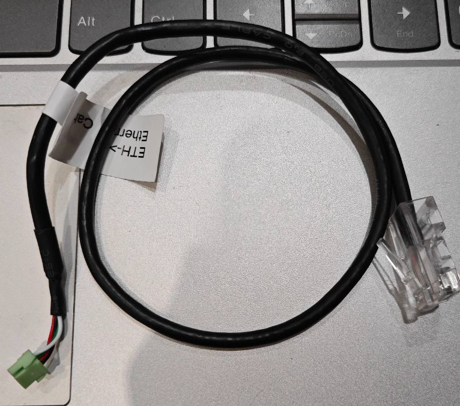

# Process Recording

## 5.23 Fri

- [x] **飞控与 RPI 的通信设置**

CUAV 7-Nano 飞控板上有一个 Eth 接口，还附带一根 RJ45--GH1.25-4P 线，于是很自然的用它与 RPI 通信。


##### 飞控上：
飞控的默认 IP 为 192.168.144.14/24，设置：

```
NET_DHCP=0
NET_ENABLE=1 
NET_P1_TYPE=1       # UDP Client
NET_P1_PROTOCAL=2   # MAVLink2
NET_P1_IP0=192
NET_P1_IP1=168
NET_P1_IP2=144
NET_P1_IP3=15
NET_P1_PORT=15001
```

`NET_P1_XXXX` 这里含义是飞控作为 UDP 的客户端，向 `udp://192.168.144.15:15001` （RPI IP）发送数据包。关于这些参数的详细解释和其他作用参考 [Complete Parameter List](https://ardupilot.org/rover/docs/parameters.html#)。

##### RPI 上

前面提到设置的 RPI IP 地址为 192.168.144.15，

参考：
- [mavros_tutorial](https://masoudir.github.io/mavros_tutorial/) （虽然是 ROS Melodic 的 tutor，但是仍然适用于当前的 mavros）
- [Ethernet / Network Setup](https://ardupilot.org/copter/docs/common-network.html#common-network)

PS. 


## 5.25 Sun

- [x] **在 RPI (Ubuntu Server 22.04.5) 上启用 X11 转发**

为了避免 desktop 占用大量资源（对 RPI 4B），我选择使用 server 版 OS，但是某些应用比如 rqt 对实际开发还是很有帮助的，CLI 调用 `ros2 echo[...]` 的效率并不高，不能快速找到自己需要的东西。
STFW 后启用 ssh 的 X11 Forwading 转发 gui 应用到宿主机上显示

在 RPI 上：
```sh
$ sudo apt update
$ sudo apt install -y xauth xorg openbox
```
可能还需要编辑 `/etc/ssh/sshd_config`，启用：
```
X11Forwarding yes
X11DisplayOffset 10
X11UseLocalhost yes

# 并重启 sshd 服务
$ sudo systemctl restart sshd
```

- [x] **rqt 插件加载问题**

树莓派上使用 `sudo apt install ros-$ROS_DISTRO-rqt*` 安装`rqt` 之后发现：

```sh
$ rqt --list-plugins

ros-humble-rqt-mocap4r2-control-dbgsym/jammy,now 0.0.7-1jammy.20250430.070001 arm64 [installed]
ros-humble-rqt-mocap4r2-control/jammy,now 0.0.7-1jammy.20250430.070001 arm64 [installed]
```

但是检查插件是全部安装好了的：

```sh
$ apt list --installed | grep "ros-$ROS_DISTRO-rqt"

WARNING: apt does not have a stable CLI interface. Use with caution in scripts.

ros-humble-rqt-action/jammy,now 2.0.1-3jammy.20250430.085713 arm64 [installed]
ros-humble-rqt-bag-plugins/jammy,now 1.1.5-1jammy.20250513.024448 arm64 [installed]
ros-humble-rqt-bag/jammy,now 1.1.5-1jammy.20250430.120846 arm64 [installed]
ros-humble-rqt-common-plugins/jammy,now 1.2.0-1jammy.20250513.025002 arm64 [installed]
ros-humble-rqt-console/jammy,now 2.0.3-1jammy.20250430.084731 arm64 [installed]
ros-humble-rqt-controller-manager/jammy,now 2.50.0-1jammy.20250430.084735 arm64 [installed]
ros-humble-rqt-dotgraph/jammy,now 0.0.4-1jammy.20250430.085903 arm64 [installed]
ros-humble-rqt-gauges/jammy,now 0.0.3-1jammy.20250430.084738 arm64 [installed]
ros-humble-rqt-graph/jammy,now 1.3.1-1jammy.20250430.085402 arm64 [installed]
ros-humble-rqt-gui-cpp-dbgsym/jammy,now 1.1.7-1jammy.20250430.065222 arm64 [installed]                                                                  [10/247]
ros-humble-rqt-gui-cpp/jammy,now 1.1.7-1jammy.20250430.065222 arm64 [installed]
ros-humble-rqt-gui-py/jammy,now 1.1.7-1jammy.20250430.084018 arm64 [installed]
ros-humble-rqt-gui/jammy,now 1.1.7-1jammy.20250430.024539 arm64 [installed]
ros-humble-rqt-image-overlay-dbgsym/jammy,now 0.1.3-1jammy.20250430.092010 arm64 [installed]
ros-humble-rqt-image-overlay-layer/jammy,now 0.1.3-1jammy.20250430.034157 arm64 [installed]
ros-humble-rqt-image-overlay/jammy,now 0.1.3-1jammy.20250430.092010 arm64 [installed]
ros-humble-rqt-image-view-dbgsym/jammy,now 1.2.0-2jammy.20250430.070002 arm64 [installed]
ros-humble-rqt-image-view/jammy,now 1.2.0-2jammy.20250430.070002 arm64 [installed]
ros-humble-rqt-joint-trajectory-controller/jammy,now 2.45.0-1jammy.20250430.084732 arm64 [installed]
ros-humble-rqt-mocap4r2-control-dbgsym/jammy,now 0.0.7-1jammy.20250430.070001 arm64 [installed]
ros-humble-rqt-mocap4r2-control/jammy,now 0.0.7-1jammy.20250430.070001 arm64 [installed]
ros-humble-rqt-moveit/jammy,now 1.0.1-3jammy.20250430.090331 arm64 [installed]
ros-humble-rqt-msg/jammy,now 1.2.0-1jammy.20250430.085224 arm64 [installed]
ros-humble-rqt-plot/jammy,now 1.1.5-1jammy.20250513.003458 arm64 [installed]
ros-humble-rqt-publisher/jammy,now 1.5.0-1jammy.20250430.085503 arm64 [installed]
ros-humble-rqt-py-common/jammy,now 1.1.7-1jammy.20250430.024617 arm64 [installed]
ros-humble-rqt-py-console/jammy,now 1.0.2-3jammy.20250430.085015 arm64 [installed]
ros-humble-rqt-reconfigure/jammy,now 1.1.2-1jammy.20250430.085248 arm64 [installed]
ros-humble-rqt-robot-dashboard/jammy,now 0.6.1-3jammy.20250430.085837 arm64 [installed]
ros-humble-rqt-robot-monitor/jammy,now 1.0.6-1jammy.20250430.085252 arm64 [installed]
ros-humble-rqt-robot-steering/jammy,now 1.0.1-1jammy.20250430.085248 arm64 [installed]
ros-humble-rqt-runtime-monitor/jammy,now 1.0.0-3jammy.20250430.085245 arm64 [installed]
ros-humble-rqt-service-caller/jammy,now 1.0.5-3jammy.20250430.085546 arm64 [installed]
ros-humble-rqt-shell/jammy,now 1.0.2-3jammy.20250430.085812 arm64 [installed]
ros-humble-rqt-srv/jammy,now 1.0.3-3jammy.20250430.085746 arm64 [installed]
ros-humble-rqt-tf-tree/jammy,now 1.0.5-1jammy.20250430.085851 arm64 [installed]
ros-humble-rqt-topic/jammy,now 1.5.0-1jammy.20250430.085816 arm64 [installed]
ros-humble-rqt/jammy,now 1.1.7-1jammy.20250430.085405 arm64 [installed]
```

ATFA (Ask The Fuck AI) 后发现是缓存问题，删除 rqt_gui 的缓存：
```sh
rm -f .config/ros.org/rqt_gui.ini 
```
之后，rqt_gui 可以正常加载已安装的插件。