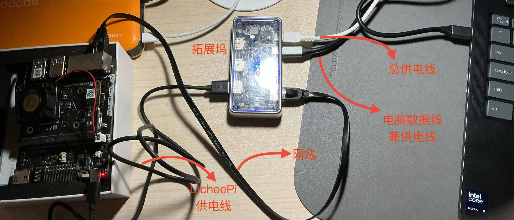
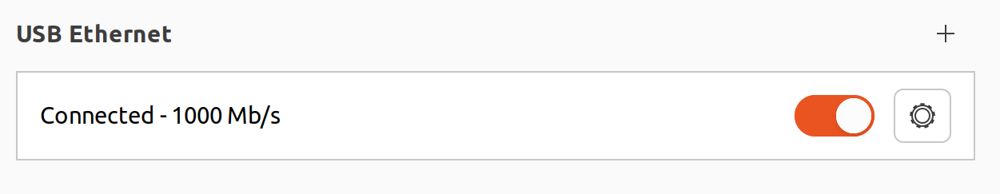
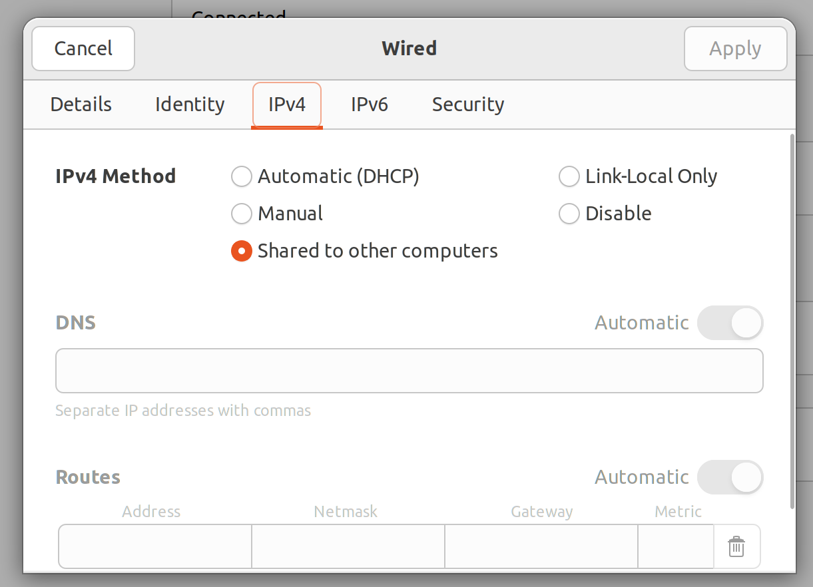

# 在 Risc-V 开发板上使用 ROS2

- [介绍](#介绍)
    - [ROS2 是什么](#ros2-是什么)
    - [为什么要用 ROS2](#为什么要用-ros2)
    - [对 RISC-V 适配良好的 OS](#对-risc-v-开发板适配良好的-os)
- [前置任务](#前置任务)
    - [镜像刷写](#1镜像刷写)
    - [安装 ROS2](#2安装-ros2)
- [实际开发](#实际开发)
    - [环境配置](#环境配置)
        - [网络连接](#一网络连接)
        - [ROS 网络域设置](#二ros-网络域设置)
        
## 介绍

### ROS2 是什么

ROS 2 是一个开源的、灵活的框架，用于编写机器人软件。它并不是一个传统意义上的操作系统 (OS)，而更像是一个元操作系统 (Meta-Operating System) 或中间件 (Middleware)。它提供了一系列库、工具和约定，旨在简化跨各种机器人平台的复杂和健壮的机器人行为的创建。

### 为什么要用 ROS2

- 强大的数据分发系统 DDS(Data Distribution System)
    - 传统的嵌入式开发主流采用 UART，SPI，I2C，CAN 等通信协议，通常是点对点或主从的紧耦合模式，通信双方需要硬编码的连接信息，可维护性和可拓展性较差。
    - DDS 采用去中心化的 Publish/Subscribe 模型，节点内无须硬编码连接信息，只需关注 Topic 和数据类型，使得系统非常模块化，可以独立开发测试任意节点，而不影响其他部分。DDS 通信的核心是数据，它将字节流处理、数据帧格式、打包解包等工作量大且易出错的环节封装起来，我们只需关注数据内容本身。
- 易于构建分布式系统
    - 传统的嵌入式开发构建分布式系统需要大量的网络编程和协议设计工作。
    - 而 DDS 的设计天然支持分布式计算，节点可以在同一设备的不同进程中，也可以分布在网络连接的不同物理设备上，通信方式对开发者透明。这对于多机器人协作、传感器网络等应用至关重要。
- 模块化与标准化
    - 传统的嵌入式开发的软件模块化程度依赖于开发者经验和项目规范，没有统一的标准，导致在阅读中大型嵌入式项目代码时容易头晕。
    - ROS2 鼓励将系统功能分解为独立的、可执行的节点。每个节点负责特定任务，非常易于开发、测试和维护。而 Package 的概念提供了标准化的软件组织方式，方便共享和重用代码、库、消息定义等。

除此之外 ROS2 还有许多关键的架构特性，篇幅所限，在此不再赘述。

### 对 Risc-V 开发板适配良好的 OS

目前对 Risc-V 和 ROS2 适配较好的 OS 有两个，一个是使用 RPM（RHEL/CentOS）做包管理的 [OpenEuler](https://www.openeuler.org/zh/)，另一个是基于 Debian 的 [RevyOS](https://docs.revyos.dev/)。

## 前置任务

### 1.镜像刷写

关于镜像刷写请参考：

- RevyOS: [LicheePi4A镜像刷写教程](https://docs.revyos.dev/docs/Installation/licheepi4a/)

- OpenEuler: [RISC-V lpi4a 安装测试openEuler ROS Humble](https://openeuler-ros-docs.readthedocs.io/en/latest/index.html)

我所刷写的是 RevyOS 目前最新版本[镜像](https://fast-mirror.isrc.ac.cn/revyos/extra/images/lpi4a/20250526/)，因此后面教程没有特殊说明都是基于 RevyOS 展开。

请根据参考文档完成镜像刷写。

刷入镜像之后的首次开机需要用到 HDMI 线和显示器，如果没有也可以通过 USBtoTTL 使用串口进入系统，进入系统后强烈建议打开 OpenSSH，方便后续使用，毕竟每次启动都要插一堆线实在是太麻烦了，有了 ssh 之后只需一根供电线一根网线（WIFI）就可以完成所有操作了。 

### 2.安装 ROS2
参考 RevyOS 文档：[Robot Operating System (ROS)](https://docs.revyos.dev/docs/desktop/software/ROS2/)

## 实际开发

受限于当前 Risc-V 不太完善的生态，很多包在编译或者使用的时候会遇到大量问题，而且这颗 TH1520 理论跑分仅与树莓派4B的 BCM2711 相似（实际体验更差），因此在 LPI 4A 上完整的运行 SLAM、Gazebo、Nav2 等高负载的任务不太现实（单开个 rqt 都卡），就算运行起来了也卡得没法用。

不过，得益于 ROS2 优秀的分布式特性，我们目前可以将计算量庞大的任务跑在宿主机之上，而计算量较小的逻辑控制部分放在 LPI 4A 上运行。

要实现宿主机（或其他开发板）与 LPI 4A 之间的 ROS2 通信，需要进行一些环境配置。

### 环境配置

环境配置非常简单（复杂的部分都被 ROS2 和 DDS 隐藏起来了，对我们而言是完全透明的），总的来说就是保证局域网的连接和 ROS 网络域设置。

#### 一、网络连接

确保宿主机和 LPI 4A 连接到 **同一个局域网** 中，可以是通过网线互相连接起来，也可以是连接到同一个路由器，这里我以 **网线连接** 做说明。

我使用拓展坞连接各个设备： 

这样做有几个好处：
- 为无网口轻薄本提供解决方案
- 电脑 USB 接口直驱开发板经常会出现电压不足的情况，使用外部供电的拓展坞能够长时间提供稳定的功率输出
- 避免反激电流直入电脑，破坏 USB 接口甚至主板，通过拓展坞供电时最多把拓展坞一块带走
- 可以再接第二、第三块板子
- 网线连接带宽够大，X11 转发时毫无压力
- 简洁优雅，强迫症友好（**重要**）

1. 线都连好开发板开机之后，宿主机上，网络设置里出现：
    
    点击设置，将 IPV4/IPV6 的方式配置成 `Shared to other computers`：
    
    `Shared to other computers` 是 NetworkManager 提供的一种简易网络共享功能。选择此项后，宿主机就扮演了一个“路由器”的角色。它会在此网络接口 (`enxf0...`) 上创建一个新的子网，并开启 DHCP 服务为连接到此接口的设备自动分配 IP 地址。同时，它通过 NAT，让 LPI 4A 可以通过宿主机的网络连接访问互联网。

2. 在终端输入 `ip addr show`：
    ```bash
    $ ip addr show
    ...
    3. enxf01e3416a7ba: <BROADCAST,MULTICAST,UP,LOWER_UP> mtu 1500 qdisc fq_codel state UP group default qlen 1000
    link/ether f0:1e:34:16:a7:ba brd ff:ff:ff:ff:ff:ff
    inet 10.42.0.1/24 brd 10.42.0.255 scope global noprefixroute enxf01e3416a7ba
       valid_lft forever preferred_lft forever
    inet6 fe80::4c5b:2dff:71bb:955b/64 scope link noprefixroute 
       valid_lft forever preferred_lft forever
    ```
    没有问题的情况下，会出现一个以 `en` 开头的网卡设备，IP 地址为 `10.42.0.1/24` ，这是 NetworkManager 在启用 `Shared to other computers` 时，默认分配给宿主机（作为网关）的 IP 地址。所有连接到这个共享网络的设备，都会被自动分配一个 `10.42.0.x/24` 形式的 IP 地址。因此， LPI 4A 此时应该已经获得了一个此网段的 IP。

3. 为了得到开发板的 IP 地址，接下来使用 `nmap` 查询这一网段下的活跃 IP：
    ```bash
    $ sudo nmap -sn 10.42.0.1/24
    Starting Nmap 7.80 ( https://nmap.org ) at 2025-07-04 00:20 CST
    Nmap scan report for 10.42.0.11
    Host is up (0.0013s latency).
    MAC Address: 48:DA:35:60:0A:16 (Unknown)
    Nmap scan report for ubuntu22 (10.42.0.1)
    Host is up.
    Nmap done: 256 IP addresses (2 hosts up) scanned in 1.97 seconds 
    ```
    可以看到我这里开发板的 IP 是 `10.42.0.11`。

4. 使用 `ssh` 进入开发板：
    ```bash
    $ ssh debian@10.42.0.11
    debian@10.42.0.11's password: 

    ____              _ ____  ____  _  __
    |  _ \ _   _ _   _(_) ___||  _ \| |/ /
    | |_) | | | | | | | \___ \| | | | ' / 
    |  _ <| |_| | |_| | |___) | |_| | . \ 
    |_| \_\\__,_|\__, |_|____/|____/|_|\_\
                |___/                    
                    -- Presented by ISCAS

    Debian GNU/Linux trixie/sid (kernel 6.6.82-th1520)

    Linux revyos-lpi4a 6.6.82-th1520 #2025.03.11.14.28+9292e379e SMP Tue Mar 11 14:48:30 UTC 2025 riscv64

    The programs included with the Debian GNU/Linux system are free software;
    the exact distribution terms for each program are described in the
    individual files in /usr/share/doc/*/copyright.

    Debian GNU/Linux comes with ABSOLUTELY NO WARRANTY, to the extent
    permitted by applicable law.
    Last login: Thu Jul  3 23:20:04 2025 from 10.42.0.1
    ```

#### 二、ROS 网络域设置
1. 分别在开发板和宿主机上设置 `ROS_DOMAIN_ID`:
    ```bash
    $ export ROS_DOMAIN_ID=42
    ```
    ROS2 的自发现机制完全由底层的 DDS RMW 提供，当一个 ROS2 节点启动时，它会向一个特点的多播地址和端口广播自己的信息，也会同时监听其他节点的信息，而每个 `ROS_DOMAIN_ID` 就对应着这个独立的多播地址和接口。是的！不同设备间仅仅只需建立网络连接，并且设置相同的 `ROS_DOMAIN_ID` 之后就可以愉快的通信了。第一次使用 ROS 时，这简单的通信设置给我带来了极大的震撼，感谢伟大的 DDS！为我们处理了所有复杂的网络发现和连接建立的细节。

2. 感受 ROS2 的强大之处:
    在宿主机上：
    ```bash
    $ ros2 run demo_nodes_cpp listener
    [INFO] [1751560183.832488108] [listener]: I heard: [Hello World: 1]
    [INFO] [1751560184.832065501] [listener]: I heard: [Hello World: 2]
    [INFO] [1751560185.832379307] [listener]: I heard: [Hello World: 3]
    [INFO] [1751560186.832445894] [listener]: I heard: [Hello World: 4]
    [INFO] [1751560187.832235328] [listener]: I heard: [Hello World: 5]
    [INFO] [1751560188.832605610] [listener]: I heard: [Hello World: 6]
    [INFO] [1751560189.832381973] [listener]: I heard: [Hello World: 7]
    [INFO] [1751560190.832143871] [listener]: I heard: [Hello World: 8]
    [INFO] [1751560191.832412211] [listener]: I heard: [Hello World: 9]
    [INFO] [1751560192.832441403] [listener]: I heard: [Hello World: 10]
    [INFO] [1751560193.832370941] [listener]: I heard: [Hello World: 11]
    [INFO] [1751560194.832474605] [listener]: I heard: [Hello World: 12]
    [INFO] [1751560195.832134111] [listener]: I heard: [Hello World: 13]
    [INFO] [1751560196.832513610] [listener]: I heard: [Hello World: 14]
    [INFO] [1751560197.832552164] [listener]: I heard: [Hello World: 15]
    ```
    在开发板上：
    ```bash
    $ ros2 run demo_nodes_cpp talker
    [INFO] [1751560183.874347348] [talker]: Publishing: 'Hello World: 1'
    [INFO] [1751560184.874430051] [talker]: Publishing: 'Hello World: 2'
    [INFO] [1751560185.874616458] [talker]: Publishing: 'Hello World: 3'
    [INFO] [1751560186.874744883] [talker]: Publishing: 'Hello World: 4'
    [INFO] [1751560187.874842662] [talker]: Publishing: 'Hello World: 5'
    [INFO] [1751560188.874974137] [talker]: Publishing: 'Hello World: 6'
    [INFO] [1751560189.875172643] [talker]: Publishing: 'Hello World: 7'
    [INFO] [1751560190.875273493] [talker]: Publishing: 'Hello World: 8'
    [INFO] [1751560191.875421038] [talker]: Publishing: 'Hello World: 9'
    [INFO] [1751560192.875510933] [talker]: Publishing: 'Hello World: 10'
    [INFO] [1751560193.875656857] [talker]: Publishing: 'Hello World: 11'
    [INFO] [1751560194.875833807] [talker]: Publishing: 'Hello World: 12'
    [INFO] [1751560195.875956771] [talker]: Publishing: 'Hello World: 13'
    [INFO] [1751560196.876183772] [talker]: Publishing: 'Hello World: 14'
    [INFO] [1751560197.876316778] [talker]: Publishing: 'Hello World: 15'
    ```


